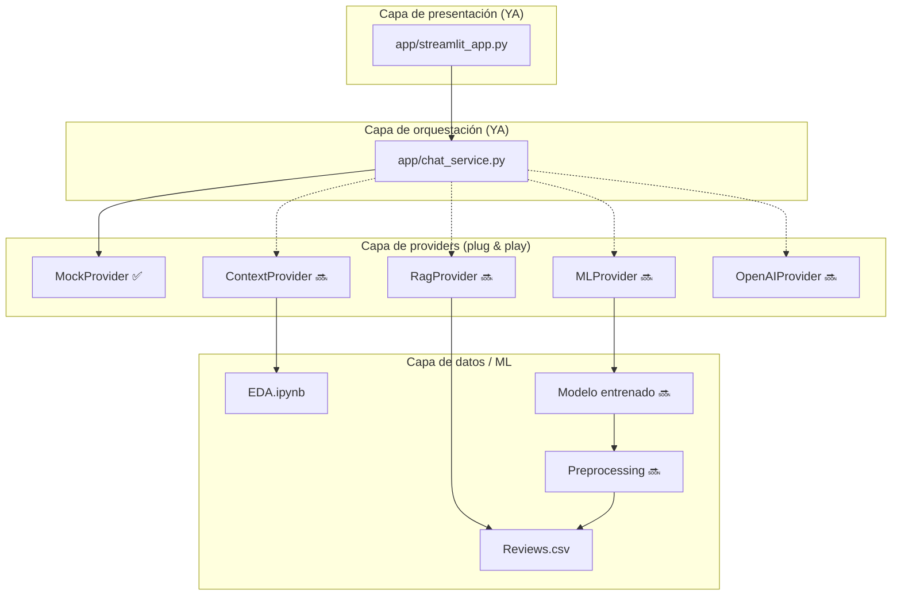

# Plan de implementación: Streamlit + IA desacoplada

Documento de trabajo para el grupo del proyecto **Ciencia-de-Datos**.  
Objetivo: construir la **interfaz pública del chat** sin depender todavía del LLM ni del modelo entrenado.

---

## 1. Visión general

El proyecto se divide en capas independientes. Cada integrante puede avanzar en paralelo sin bloquear al resto.



### Regla de oro

> `streamlit_app.py` **no se reescribe** cuando conecten un backend nuevo.  
> Solo se agrega un archivo en `app/providers/` y una línea en `get_provider()`.

---

## 2. Estado actual del proyecto

| Componente | Estado | Responsable sugerido |
|------------|--------|----------------------|
| EDA (`EDA.ipynb`) | En progreso | Equipo de datos |
| `utils/plot_functions.py` | Listo | Equipo de datos |
| UI Streamlit | **Listo (mock)** | Quien lleve frontend |
| `ChatService` | **Listo** | Quien lleve frontend |
| `MockProvider` | **Listo** | Quien lleve frontend |
| Preprocessing | Pendiente | Rama `preprocessing` |
| Modelo ML | Pendiente | Rama `entrenamiento` |
| LLM / RAG | Pendiente | Rama `predicciones` o `rag` |
| Deploy público | Pendiente | Quien lleve frontend |

---

## 3. Estructura de archivos

```
Ciencia-de-Datos/
├── app/
│   ├── streamlit_app.py       # Solo UI (chat, sidebar, estado)
│   ├── chat_service.py        # Orquestación + selección de backend
│   └── providers/
│       ├── base.py            # Contrato abstracto
│       ├── mock.py            # Backend simulado (activo ahora)
│       ├── context_provider.py  # Fase 2 (futuro)
│       ├── ml_provider.py     # Fase 3 (futuro)
│       ├── rag_provider.py    # Fase 4 (futuro)
│       └── openai_provider.py # Fase 4 (futuro)
├── docs/
│   └── PLAN_STREAMLIT.md      # Este documento
├── utils/
│   └── plot_functions.py
├── data/
│   └── Reviews.csv            # No commitear (ver .gitignore)
├── EDA.ipynb
├── requirements.txt
├── .env.example
├── .gitignore
└── .streamlit/
    └── config.toml
```

---

## 4. Contrato entre capas

Todos los providers implementan la misma interfaz:

```python
class ModelProvider(ABC):
    def generate(self, messages: list[dict]) -> str: ...
```

### Formato de `messages`

```python
[
    {"role": "system", "content": "Instrucciones del asistente"},
    {"role": "user", "content": "¿Cuál es el score promedio?"},
    {"role": "assistant", "content": "El promedio es 4.18..."},
    {"role": "user", "content": "¿Y los productos top?"},
]
```

### Qué hace cada capa

| Capa | Responsabilidad | Qué NO debe hacer |
|------|-----------------|-------------------|
| `streamlit_app.py` | Renderizar chat, historial, sidebar | Llamar APIs, cargar CSV, entrenar modelos |
| `chat_service.py` | Armar historial, system prompt, elegir provider | Renderizar widgets de Streamlit |
| `providers/*.py` | Generar la respuesta | Conocer Streamlit |
| `EDA.ipynb` / scripts ML | Análisis y entrenamiento | Renderizar UI |

---

## 5. Fases de implementación

### Fase 0 — Mock + UI (AHORA) ✅

**Objetivo:** Tener la interfaz pública funcionando sin LLM.

**Entregables:**
- [x] `MockProvider`
- [x] `ChatService`
- [x] `streamlit_app.py` con chat
- [x] Sidebar con estado del sistema
- [x] Botón "Reiniciar conversación"
- [ ] Probar en local
- [ ] Deploy en Streamlit Cloud

**Criterio de éxito:** Cualquier integrante puede abrir la app, escribir una pregunta y recibir una respuesta mock coherente.

**Preguntas de prueba:**
- "¿Cuál es el score promedio?"
- "¿Qué productos tienen más reseñas?"
- "¿Cómo funciona el helpfulness?"
- "Hola" (respuesta genérica mock)

---

### Fase 1 — EDA estable + paths portables

**Objetivo:** Que el proyecto corra en cualquier máquina del grupo.

**Tareas:**
- [ ] Mover `Reviews.csv` a `data/Reviews.csv`
- [ ] Reemplazar paths absolutos en `EDA.ipynb`
- [ ] Documentar descarga del dataset en README
- [ ] Corregir bug `review_length` (palabras vs caracteres)
- [ ] Decidir tratamiento de duplicados (1.309 filas)
- [ ] Exportar resumen del EDA a `data/eda_summary.json`

**Salida para fases siguientes:**
```json
{
  "total_reviews": 568454,
  "avg_score": 4.18,
  "score_distribution": {"1": 52268, "2": 29769, "3": 42640, "4": 80655, "5": 363122},
  "date_range": ["1999-10-08", "2012-10-26"],
  "top_products": {"B001E4KFG0": 983, "...": "..."}
}
```

**Rama Git sugerida:** `preprocessing`

---

### Fase 2 — ContextProvider

**Objetivo:** Que el asistente responda con datos reales del EDA, sin LLM todavía (o como contexto para un LLM futuro).

**Archivo nuevo:** `app/providers/context_provider.py`

**Lógica:**
1. Leer `data/eda_summary.json` (liviano, no cargar 568k filas en cada pregunta)
2. Inyectar ese resumen en el system prompt
3. Responder con reglas simples o delegar a LLM cuando exista

**Cambio en `get_provider()`:**
```python
elif backend == "context":
    from providers.context_provider import ContextProvider
    return ContextProvider()
```

**Variable de entorno:**
```
CHAT_BACKEND=context
```

**Criterio de éxito:** Las respuestas citan estadísticas reales exportadas del EDA.

**Rama Git sugerida:** `feature/context-provider`

---

### Fase 3 — MLProvider (modelo propio)

**Objetivo:** Conectar el modelo que entrenen (ej. predecir score o sentimiento).

**Prerequisitos:**
- Script de preprocessing (`src/preprocess.py` o notebook)
- Modelo serializado en `models/sentiment.pkl` o similar
- Función de inferencia probada fuera de Streamlit

**Archivo nuevo:** `app/providers/ml_provider.py`

**Ejemplo de interfaz:**
```python
class MLProvider(ModelProvider):
    def generate(self, messages: list[dict]) -> str:
        text = messages[-1]["content"]
        prediction = self.model.predict([text])[0]
        return f"Predicción: {prediction} estrellas"
```

**Cambio en `get_provider()`:**
```python
elif backend == "ml":
    from providers.ml_provider import MLProvider
    return MLProvider()
```

**Variable de entorno:**
```
CHAT_BACKEND=ml
```

**Criterio de éxito:** El chat responde usando el modelo entrenado del grupo, sin cambiar la UI.

**Rama Git sugerida:** `entrenamiento` → merge a `main` → `feature/ml-provider`

---

### Fase 4 — OpenAIProvider + RagProvider (opcional)

**Objetivo:** Respuestas en lenguaje natural con evidencia de reseñas reales.

#### 4a. OpenAIProvider

**Archivo:** `app/providers/openai_provider.py`

**Secrets (local y Streamlit Cloud):**
```
OPENAI_API_KEY=sk-...
CHAT_BACKEND=openai
```

**Buenas prácticas:**
- Usar `gpt-4o-mini` para demos (barato)
- Temperature baja (0.2–0.3) para respuestas más factuales
- Combinar con `eda_summary.json` en el system prompt

#### 4b. RagProvider

**Archivo:** `app/providers/rag_provider.py`

**Pipeline:**
1. Preprocesar reseñas → chunks de texto
2. Generar embeddings (`sentence-transformers`)
3. Guardar en vector store (`chromadb` o similar)
4. Al preguntar: buscar top-k chunks similares
5. Pasar chunks + pregunta al LLM

**Dependencias extra:**
```
chromadb
sentence-transformers
openai
```

**Criterio de éxito:** El asistente responde citando fragmentos de reseñas reales.

**Rama Git sugerida:** `feature/rag`

---

### Fase 5 — Deploy público

**Objetivo:** URL compartible para la facultad.

**Pasos:**
1. Push del código a GitHub
2. Entrar a [share.streamlit.io](https://share.streamlit.io)
3. New app → repo → rama → `app/streamlit_app.py`
4. Configurar Secrets según el backend activo
5. Compartir URL: `https://<nombre-app>.streamlit.app`

**Secrets para fase mock (ahora):**
```toml
CHAT_BACKEND = "mock"
```

**Secrets para fase openai (futuro):**
```toml
CHAT_BACKEND = "openai"
OPENAI_API_KEY = "sk-..."
```

---

## 6. Cómo probar la app AHORA (Fase 0)

### Requisitos

- Python 3.10 o superior
- Conexión a internet (solo para `pip install`)

### Paso 1 — Ir a la carpeta del proyecto

```powershell
cd "c:\Users\Federico\Documents\FACULTAD\2026\ciencia de datos\Ciencia-de-Datos"
```

### Paso 2 — Crear entorno virtual (recomendado)

```powershell
python -m venv .venv
.\.venv\Scripts\Activate.ps1
```

Si PowerShell bloquea scripts:
```powershell
Set-ExecutionPolicy -Scope CurrentUser RemoteSigned
```

### Paso 3 — Instalar dependencias

```powershell
pip install -r requirements.txt
```

### Paso 4 — Configurar variables (opcional en fase mock)

```powershell
copy .env.example .env
```

El archivo `.env` ya trae `CHAT_BACKEND=mock`. No necesitás API key.

### Paso 5 — Levantar Streamlit

```powershell
streamlit run app/streamlit_app.py
```

Se abre automáticamente en el navegador:
```
http://localhost:8501
```

### Paso 6 — Probar el chat

1. Escribí: `¿Cuál es el score promedio?`
2. Deberías ver una respuesta con prefijo **[MOCK]**
3. Probá el botón **Reiniciar conversación** en el sidebar
4. Verificá que el sidebar muestre: Backend MOCK, LLM no conectado

### Solución de problemas

| Error | Causa probable | Solución |
|-------|---------------|----------|
| `streamlit no se reconoce` | No activaste el venv o no instalaste deps | `pip install streamlit` |
| `ModuleNotFoundError: providers` | Ejecutaste desde otra carpeta | Asegurate de correr el comando desde la raíz del repo |
| La página no abre | Puerto ocupado | `streamlit run app/streamlit_app.py --server.port 8502` |
| `Activate.ps1` bloqueado | Política de ejecución | Ver comando `Set-ExecutionPolicy` arriba |

---

## 7. Cómo conectar un backend nuevo (checklist)

Cuando una fase esté lista, seguir siempre estos pasos:

- [ ] Crear `app/providers/<nombre>_provider.py`
- [ ] Implementar `generate(self, messages) -> str`
- [ ] Agregar caso en `get_provider()` de `chat_service.py`
- [ ] Documentar variable `CHAT_BACKEND` en `.env.example`
- [ ] Probar en local con `CHAT_BACKEND=<nuevo>`
- [ ] Actualizar Secrets en Streamlit Cloud
- [ ] **No modificar** `streamlit_app.py` salvo que cambie algo visual

---

## 8. Convenciones del grupo

### Ramas Git (según README)

| Rama | Contenido |
|------|-----------|
| `main` | Código estable |
| `preprocessing` | Limpieza de datos, export de `eda_summary.json` |
| `entrenamiento` | Notebooks/scripts de ML |
| `feature/streamlit-chat` | UI y providers |
| `feature/rag` | RAG (opcional) |

### Formato de commits sugerido

```
feat(streamlit): agregar MockProvider y chat UI
feat(context): exportar eda_summary.json desde EDA
feat(ml): conectar MLProvider con modelo de sentimiento
docs: actualizar plan de deploy en Streamlit Cloud
```

---

## 9. Roadmap visual

```
Semana 1   [██████████] Fase 0: Mock + UI + prueba local
Semana 2   [░░░░░░░░░░] Fase 1: EDA portable + eda_summary.json
Semana 3   [░░░░░░░░░░] Fase 2: ContextProvider
Semana 4   [░░░░░░░░░░] Fase 3: MLProvider
Semana 5+  [░░░░░░░░░░] Fase 4: OpenAI / RAG (opcional)
           [░░░░░░░░░░] Fase 5: Deploy público
```

---

## 10. Preguntas frecuentes

### ¿Puedo trabajar en Streamlit sin tener el CSV?

**Sí.** La fase mock no necesita datos. La UI es independiente.

### ¿Tengo que esperar a que terminen el EDA?

**No.** Podés avanzar la UI en paralelo. Cuando el EDA esté listo, conectan `ContextProvider`.

### ¿Cómo cambio de mock a otro backend?

Solo cambiá la variable de entorno:
```powershell
$env:CHAT_BACKEND="ml"
streamlit run app/streamlit_app.py
```

### ¿La UI cambia cuando conectemos el LLM?

**No.** Solo cambian las respuestas y el indicador del sidebar (que se puede actualizar después para leer el backend activo dinámicamente).

### ¿Cuánto cuesta el deploy?

Streamlit Community Cloud es **gratuito** para apps públicas. El costo aparece cuando usen APIs de pago (OpenAI), no por Streamlit en sí.

---

## 11. Próximo paso inmediato

1. Ejecutar `streamlit run app/streamlit_app.py` en tu máquina
2. Confirmar que el chat mock funciona
3. Hacer push a GitHub en rama `feature/streamlit-chat`
4. Deploy en Streamlit Cloud con `CHAT_BACKEND=mock`
5. Compartir la URL con el grupo

Cuando el EDA exporte `eda_summary.json`, avanzamos a **Fase 2: ContextProvider**.
